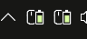
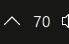
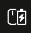
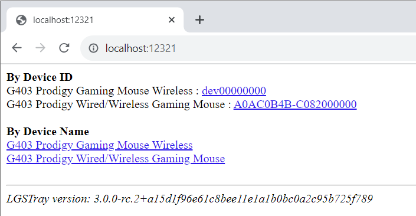

# LGS Tray Battery

A rewrite/combination of my two programs [LGSTrayBattery](https://github.com/andyvorld/LGSTrayBattery) and [LGSTrayBattery_GHUB](https://github.com/andyvorld/LGSTrayBattery_GHUB), which should allow for interaction via both the native HID and Logitech GaminG Hub websockets.

## How to install

[](https://github.com/andyvorld/LGSTrayBattery/releases/latest)


Please, visit [the latest release page](https://github.com/andyvorld/LGSTrayBattery/releases/latest) and download the release zip files from assets. Builds with the `-standalone` suffix are pre-bundled with .Net 8 and does not require any further dependencies, the non-standalone version requires .Net 8 to be pre-installed (https://dotnet.microsoft.com/en-us/download/dotnet/8.0).

## Changes from V2
*When migrating from earlier versions, device ids may have changed.*
- Moved to .Net 8
- Realtime reactive icons and rich tooltips
    - Light/Dark theme is now reactive in realtime
- Rewritten to use hidapi directly for hotplug support
    - Wired/Wireless devices like the G403 should behave like a single device
- Multi-device mode
- Numerical Icons
- HID.NET manager has been deprecated
- Migrated to using a `.toml` for appsettings

## Features
### Tray Indicator


Battery percentage and voltage (if supported) in a tray tooltip with notification icon.

Right-click for more options.

### Multiple Icons


Depending on the number of devices selected in the context menu, multiple devices can be seen simultatniously

### Numerical Icons


Display the current battery percentage as a number.

*In numerical display mode, charging status will not be displayed*

### Reactive Icons


*Icon changes to match devices type (Current supported: mouse, keyboard and headsets)*


*Icon changes to match light/dark system theme*



*Icon changes to reflect current charging status*

### Http/Web "server" api
By default the running of the http server is enabled. The IP address and port used for bindings are under `addr` and `port` respectively with the defaults being `localhost` and `12321`.

`addr` accepts either a hostname (`DESKTOP-1234`) or an IP address (`127.0.0.1`) to bind to, if you are not sure use `localhost` or if you have admin permission `0.0.0.0` to bind to all interfaces.

IPv6 can also be disabled with `useIpv6` in the event that dual stack networking is causing issues.

If any issues arise from running the server, it can be turned off by the `enable` value in `appsettings.toml` under `[HTTPServer]`.



Visit `http://{addr}:{port}/` on your browser to view the list of devices available.


With the `deviceID`, a HTTP/GET request to `{addr}:{port}/device/{deviceID}`, will result in an xml document of the name and battery status of the device. Devices that do not support `battery_voltage` will report 0.00.

Device ids starting with `dev` originates from tapping into Logitech GHUB's own drivers, while random numbers are from the natively implement HID++ code. Thus, there are some fields that different between the two,

|                 | GHUB* | Native  |
|-----------------|-------|---------|
| device_id       | ✔️   | ✔️     |
| device_name     | ✔️   | ✔️     |
| device_type     | ✔️   | ✔️     |
| battery_percent | ✔️   | ✔️     |
| battery_voltage | ❌   | ✔️**   |
| mileage***      | ✔️   | ❌     |
| charging        | ✔️   | ✔️     |

\* - Requires Logitech G Hub Installed

\** - Depends on the device

\*** - Logitech G Hub's metric of estimated life left on the battery

## HID++ Device Sources
As of v3.0.0, there are 2 sources in which the program will pull battery status,

- Logitech G Hub via Websockets
- Native HID, hidapi via PInvoke (Called "Native" in settings)

These sources can be individually disabled/enabled before runtime via `appsettings.toml`, in the their respective sections,

```
[GHub]
enabled = true

[Native]
enabled = true
```

*GHub is Logitech G Hub, Native is hidapi*

## appsettings.toml
Refer to https://toml.io/en/ for a guide on toml syntax.

*Note the `"` around strings*

In the event of an invalid settings, at launch the app will prompt you for a reset to the default settings.


### `[Native]` settings
- `retryTime` - The time in seconds to re-try a device on a failed device state query; usually the device is asleep.
- `pollPeriod` - The time in seconds to request an update from the device, keep this as high as possible as it may interfere with the default power saving sleep modes of devices.
- `disabledDevices` - If all else fails, and the addition of a new device has caused the app to be unusable. Adding a part of the device name into this list will prevent the device from being polled. E.g. The following will disable the G403 and G502,
```
disabledDevices = [
    "G403",
    "G502"
]
```

## Known Issues
### Common
- Native HID and GHUB do not provide similar percentages, this is due to how native and GHUB calculates percentages from the device's voltages. Native uses an average curve of a 3.7V lipo battery, while GHUB will use a lookup table specific to the device.

### Native HID (hidapi)
- Certain wired devices like the G403 when in wired mode does not report the number of HID devices connected and will respond to all request. Causing battery polls to occur 6x per request.
- Device and protocol discovery changed from the previous method, some devices like the G533 headsets might not be detected, try the GHUB based manager.

### GHUB
- Future GHUB version may change IPC protocol/endpoints (currently websocket)

## Working with
- G403 Wireless
- MX Anywhere 2

### Community Tested
*HID Backend has changed, would need restesting of devices, please raise a PR to add to this list*


## How to Build project
TBA

## Acknowledgements
This project began as a task with me messing around with my mouse for battery tracking.

- [Solaar](https://github.com/pwr-Solaar/Solaar), for the source code to base the HID++ paramters and reverse engineering of the protocol.
- [XB1ControllerBatteryIndicator](https://github.com/NiyaShy/XB1ControllerBatteryIndicator), for the idea and base of the icons
- [The Noun Project](https://thenounproject.com/), for base icons
    - Mouse, By projecthayat, ID, In the Technology & computer hardware Collection
    - Keyboard, By HideMaru, ID, In the Electronic BL.2 Collection
    - Headphones, By Peter Lakenbrink, DE, In the School and Online Learning Glyph Collection
